# AquaPort - Sistema de Drones Acuáticos de la ECI

Refuerzo de temáticas de desarrollo y arquitectura de software (DOSW). El proyecto implementa un sistema para la gestión, asignación y monitoreo de drones acuáticos en el campus de la Escuela Colombiana de Ingeniería, estructurado en tres niveles de evolución.

## Nivel 1: Piplup (MVP)

En esta primera etapa se construye la base funcional del sistema considerando una flota reducida de drones, asignación manual por parte del operador y zonas hídricas fijas.

### Reto 01: Streams y Lambdas

Se implementó el componente de consulta de flota mediante la API de Streams de Java 21, evitando estructuras iterativas tradicionales y variables de estado mutables.

Aspectos implementados:
* Definición del modelo DroneAcuatico como record inmutable para representar la información de cada unidad.
* Consulta de drones disponibles con batería mínima del 35%, ordenados de forma descendente por nivel de carga usando filter y sorted.
* Transformación de la colección para extraer únicamente los identificadores de los drones disponibles mediante map.
* Evaluación de existencia de unidades operativas aptas mediante anyMatch.
* Conteo de drones disponibles en la flota a través de count.
* Búsqueda del drone con mayor nivel de batería mediante max y Optional.
* Ejecución demostrativa en método main y validación automatizada mediante pruebas unitarias en JUnit 5.

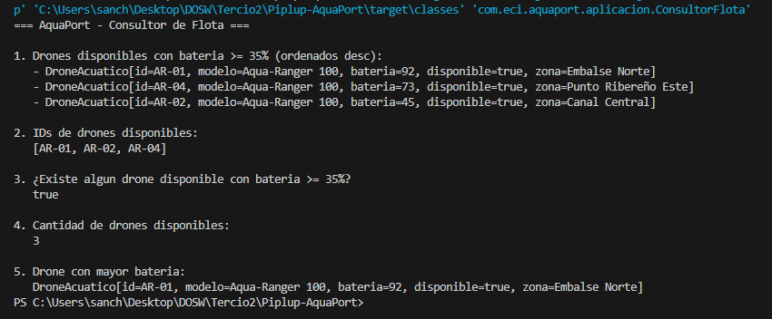

### Reto 02: GitHub y GitFlow

Se configuró el flujo de trabajo colaborativo y control de versiones bajo el modelo GitFlow, asegurando trazabilidad y aislamiento de cambios.

Aspectos implementados:
* Configuración de archivo .gitignore excluyendo artefactos de compilación, carpetas de IDEs y dependencias locales.
* Estructura de ramas principales con rama main para versiones estables y rama develop para integración.
* Creación de la rama feature/streams-consultor-flota para el desarrollo del primer reto.
* Registro de commits atómicos con mensajes en presente y en español describiendo el alcance exacto de cada cambio.
* Integración de la funcionalidad en develop mediante Pull Request revisado y fusionado en GitHub.

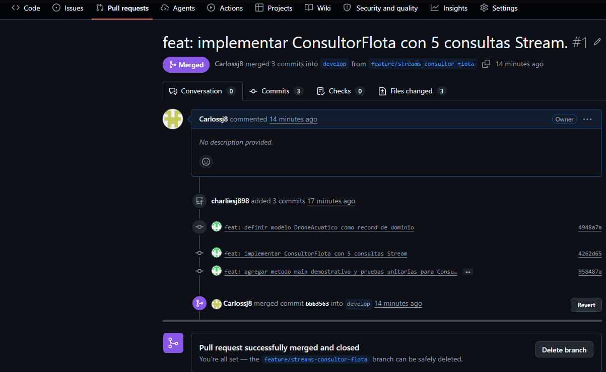

### Reto 03: Patrones de Diseño - Builder

Se aplicó el patrón creacional Builder para la construcción controlada de instancias de la clase Mision, garantizando la integridad de los datos antes de permitir la existencia del objeto.

Aspectos implementados:
* Creación de los enums de dominio TipoCarga y EstadoMision.
* Ocultamiento del constructor de Mision haciéndolo privado, restringiendo la instanciación únicamente al Builder interno.
* Validación estricta en el método build para impedir identificadores, puntos de partida o de llegada nulos o en blanco.
* Regla de negocio que verifica que el drone asignado se encuentre en estado disponible antes de crear la misión.
* Asignación de estado por defecto PENDIENTE cuando no se suministra uno explícito.
* Pruebas unitarias en JUnit 5 que comprueban tanto la construcción exitosa como el lanzamiento de IllegalStateException en cada caso inválido.

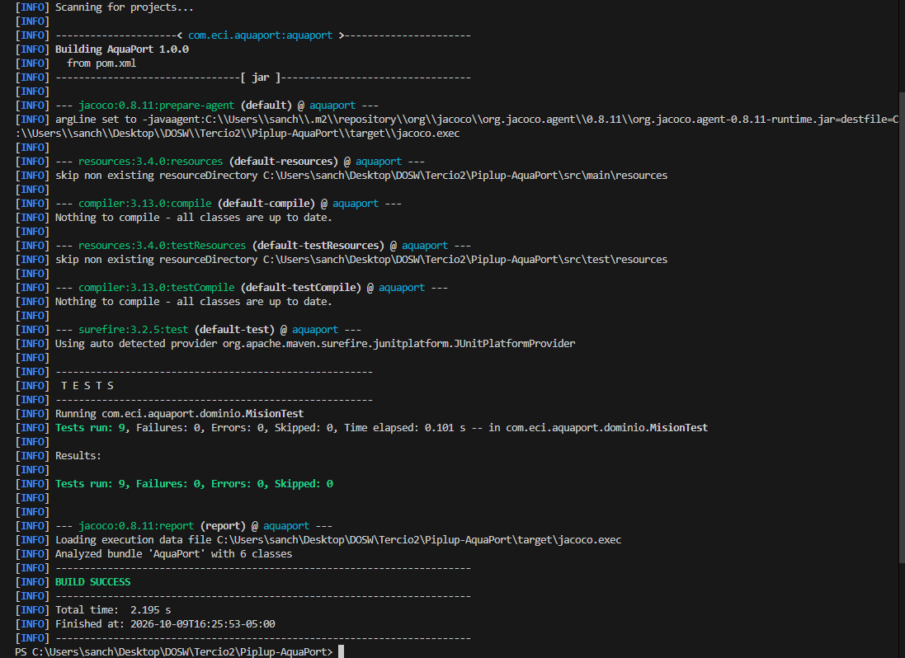

### Reto 04: Principios SOLID (SRP y DIP)

Se rediseñó el núcleo del sistema aplicando el Principio de Responsabilidad Única (SRP) y el Principio de Inversión de Dependencias (DIP) para eliminar el acoplamiento y la acumulación de responsabilidades.

Aspectos implementados:
* Segregación de responsabilidades mediante clases especializadas: RegistradorMisiones coordina el flujo, ValidadorMision encapsula las reglas de negocio, y NotificadorOperador gestiona la comunicación con el usuario.
* Definición de la interfaz RepositorioMisiones en la capa de dominio, aislando la lógica de negocio de los detalles de almacenamiento.
* Implementación en memoria RepositorioMisionesMemoria ubicada en infraestructura.
* Inyección de dependencias por constructor en RegistradorMisiones, permitiendo desacoplamiento total y facilitando el uso de dobles de prueba.
* Pruebas unitarias que verifican validaciones, persistencia, manejo de identificadores duplicados y emisión de notificaciones.

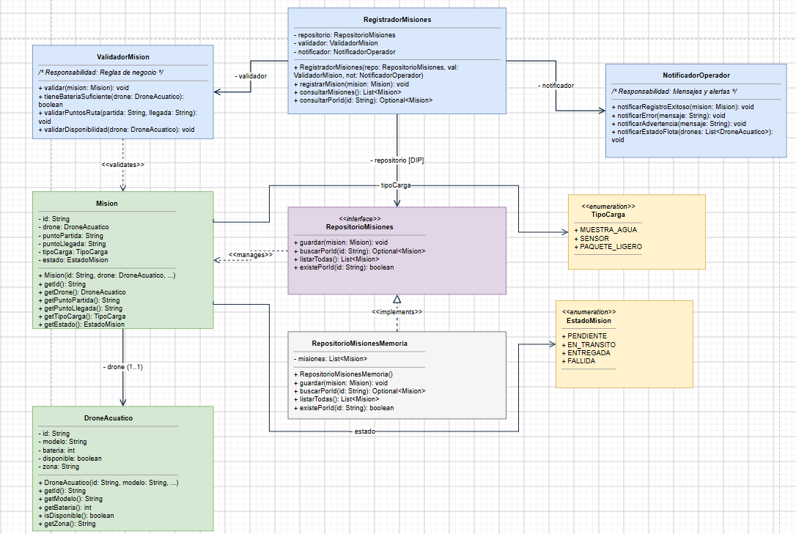

### Reto 05: Diagrama de Contexto C4 (Nivel 1)

Se elaboró el diagrama de contexto C4 correspondiente al nivel 1 para delimitar las fronteras del sistema AquaPort MVP, identificando a los usuarios externos y los flujos de información sin exponer detalles internos de implementación.

Aspectos modelados:
* Sistema central: AquaPort MVP como sistema autónomo de supervisión y gestión de drones acuáticos en el campus de la Escuela Colombiana de Ingeniería.
* Actor Operador Hídrico: Encargado de registrar misiones, consultar la disponibilidad de drones y asignar unidades de forma manual.
* Actor Solicitante: Investigador o miembro del campus que genera requerimientos de transporte de muestras de agua y sensores.
* Actor Administrador ECI: Rol directivo que consulta métricas, reportes de desempeño y estado consolidado de la flota.
* Delimitación del MVP: Ausencia de integraciones con sistemas externos en esta primera fase.
* Relaciones etiquetadas: Definición explícita de los datos y solicitudes que viajan entre cada actor y el sistema central.

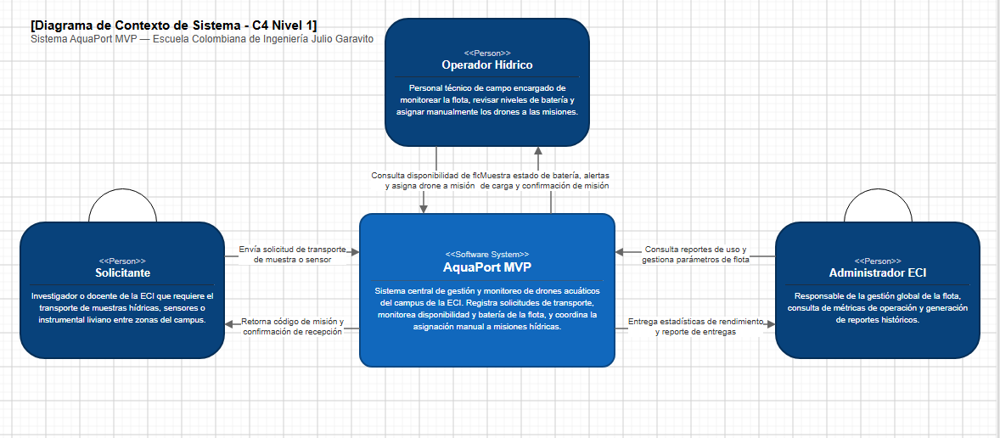

### Reto 06: Requisitos Funcionales, No Funcionales y MoSCoW

Se definieron los requisitos nucleares para AquaPort MVP especificando el actor, la acción y el resultado observable para los funcionales, y métricas cuantitativas para los no funcionales.

#### Requisitos Funcionales (RF)
* RF-01 (Consultar disponibilidad de flota): El Operador Hídrico consulta la flota de drones para visualizar en pantalla el identificador, zona actual y nivel de batería de las unidades disponibles con carga mayor o igual al 35%.
* RF-02 (Registrar y asignar misión de transporte): El Operador Hídrico ingresa los puntos de origen y destino, tipo de carga y asigna manualmente un drone disponible, obteniendo como resultado un identificador único de misión y el registro persistido.
* RF-03 (Consultar estado de misión por identificador): El Solicitante introduce el identificador de su misión para conocer en tiempo real el estado de entrega y el drone responsable asignado.

#### Requisitos No Funcionales (RNF)
* RNF-01 (Tiempo de respuesta de consulta): La consulta de drones disponibles y ordenados por nivel de batería debe ejecutarse en menos de 200 milisegundos para una flota de hasta 10 drones, validado mediante JUnit 5 assertTimeout.
* RNF-02 (Integridad de datos y validación temprana): El sistema debe impedir el 100% de los intentos de registro que contengan campos nulos, puntos de ruta inválidos o drones con batería inferior al 35%, lanzando excepciones de negocio de forma inmediata.
* RNF-03 (Mantenibilidad y cobertura de pruebas): La capa de dominio y validación de misiones debe mantener una cobertura de líneas de código superior o igual al 80%, medida y auditada mediante JaCoCo en la fase de test.

#### Priorización MoSCoW

| Requisito | Tipo | Prioridad MoSCoW | Justificación |
| :--- | :--- | :--- | :--- |
| RF-01 | Funcional | Must Have | Indispensable para que el operador conozca las unidades operativas antes de autorizar cualquier despacho. |
| RF-02 | Funcional | Must Have | Constituye la funcionalidad nuclear de negocio del MVP para posibilitar el transporte de muestras en el campus. |
| RNF-02 | No Funcional | Must Have | Crítico para evitar que se despachen drones descargados o se almacenen registros inconsistentes en el sistema. |
| RF-03 | Funcional | Should Have | Importante para la trazabilidad y consulta por parte de los solicitantes, aunque no detiene la operación física de los drones. |
| RNF-01 | No Funcional | Should Have | Relevante para asegurar una experiencia de usuario ágil durante la consulta manual de la flota en el panel. |
| RNF-03 | No Funcional | Could Have | Conveniente para asegurar la calidad técnica del código base previo a su escalamiento hacia los niveles autónomos. |

### Reto 07: Plantilla DOSW (Especificación de Requerimiento)

Se documentó detalladamente la especificación formal del requerimiento funcional AP-01 utilizando el estándar de la plantilla institucional DOSW, alojada en el repositorio en `docs/word/Plantilla_Requerimientos_DOSW_EjercicioTHC.docx`.

Aspectos documentados en la plantilla:
* Código y nombre: AP-01 Registrar misión de transporte de muestra.
* Actor principal: Operador Hídrico.
* Precondición: Existencia en el sistema de al menos un drone acuático disponible con nivel de batería mayor o igual al 35%.
* Estructura de datos de entrada: Tipos de datos reales de dominio para drone asignado (DroneAcuatico), puntoPartida (String), puntoLlegada (String) y tipoCarga (Enum: MUESTRA_AGUA, SENSOR, PAQUETE_LIGERO), evitando elementos genéricos de interfaz gráfica.
* Datos de salida: Identificador alfanumérico generado para la misión y confirmación de persistencia.
* Flujo básico de eventos: Secuencia ordenada de 5 pasos desde la selección de parámetros, validación de disponibilidad, verificación de zonas hídricas hasta la confirmación al operador.
* Flujos alternos: Manejo de escenarios excepcionales para batería crítica del drone (<35%), zonas fuera de cobertura y coincidencia de origen y destino.
* Reglas de negocio: Exclusividad de misión activa por drone y validación obligatoria del umbral mínimo de carga.

### Reto 08: Manual de Identidad y UX/UI

Se estableció el manual de identidad visual y el diseño del panel de monitoreo de flota acuática para el operador, asegurando coherencia visual y cumplimiento de principios de usabilidad antes de la fase de implementación de interfaz.

Aspectos definidos en la identidad:
* Paleta de colores técnica y ambiental inspirada en entornos hídricos, definiendo tonos primarios y fondos oscuros adecuados para paneles de control continuo.
* Código cromático semántico de estados: verde para unidades disponibles, azul para drones en misión, ámbar para recarga, gris para mantenimiento y rojo para fallos.
* Tipografía principal sans-serif de alta legibilidad para interfaces de monitoreo y tipografía monoespaciada para identificadores de drones y códigos de misión.
* Tono de voz técnico, conciso y contextualizado a la gestión hídrica del campus.

#### Evidencias del Manual de Identidad

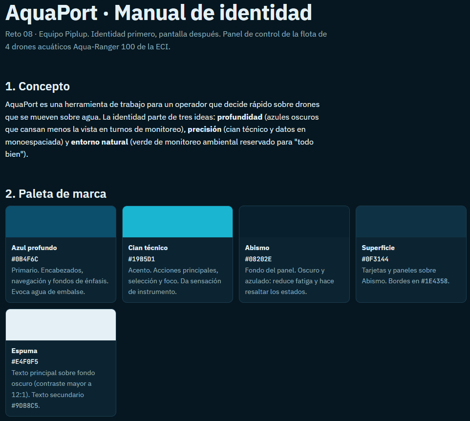

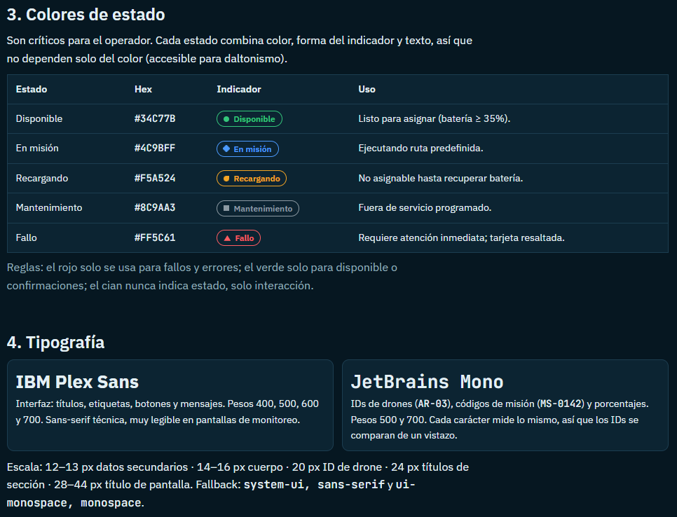

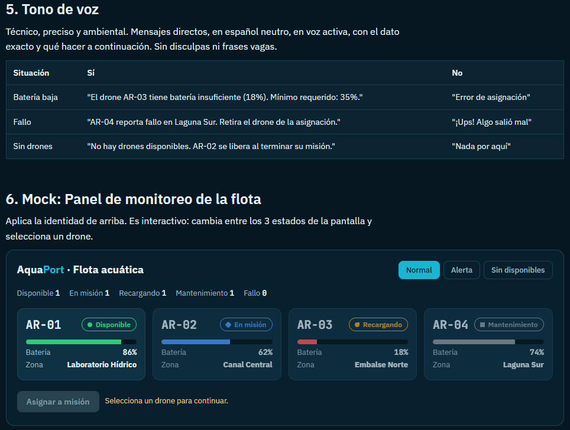

#### Evidencias del Mockup de Panel de Flota

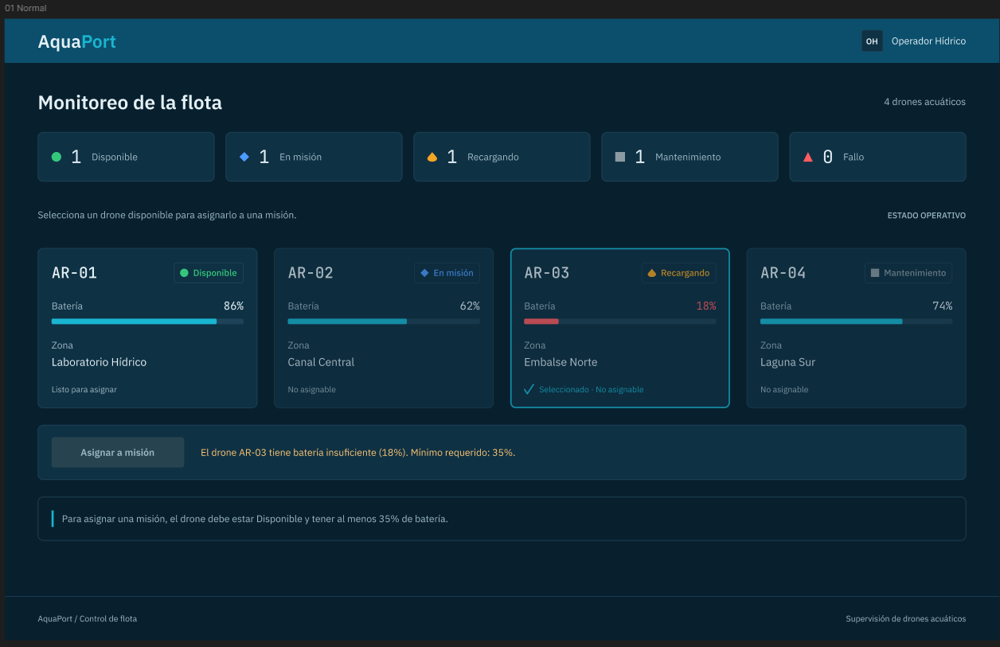

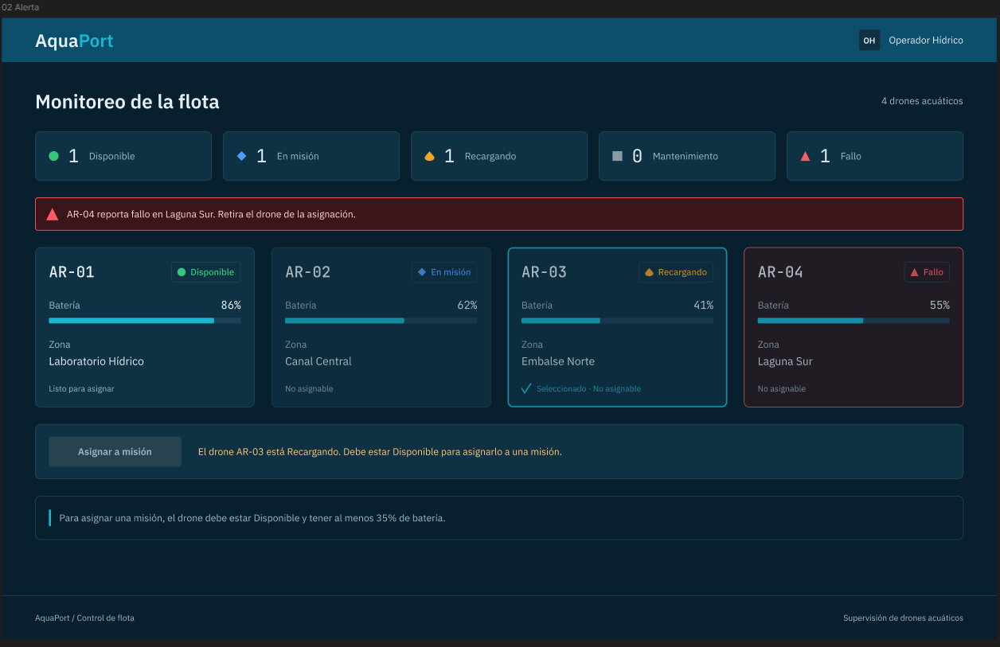

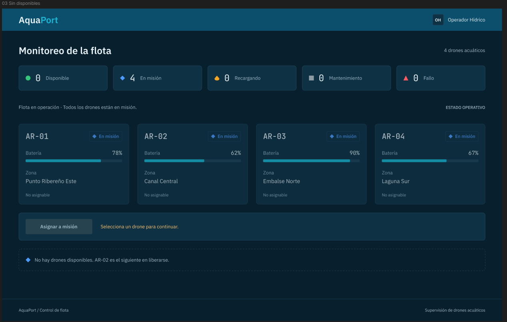

#### Verificación de Heurísticas de Nielsen

El diseño del panel de monitoreo fue evaluado frente a las heurísticas de usabilidad de Jakob Nielsen, cumpliendo 6 de los 10 principios fundamentales:

| Heurística | Cómo la cumple el mock |
| :--- | :--- |
| #1 Visibilidad del estado | Cada tarjeta muestra estado (color, forma y texto), batería y zona sin hacer clic. El resumen superior cuenta los drones por estado. |
| #2 Relación con el mundo real | Usa el lenguaje del operador: nombres reales de zonas (Embalse Norte, Canal Central...) y estados como "En misión" o "Recargando". |
| #4 Consistencia | Los mismos 5 colores, formas y textos de estado se usan en el manual y en el panel. Los IDs siempre van en monoespaciada con formato AR-XX. |
| #5 Prevención de errores | Los drones con batería menor a 35% o no disponibles se atenúan y el botón "Asignar a misión" queda deshabilitado antes de intentar la acción. |
| #8 Diseño minimalista | Cada tarjeta muestra solo ID, estado, batería y zona: lo necesario para decidir. |
| #9 Mensajes de error claros | El motivo del bloqueo aparece junto al botón con dato y umbral ("batería insuficiente (18%). Mínimo requerido: 35%"). El fallo muestra un banner con el drone y la zona. |

### Reto 09: Agilismo y Gestión en Jira

Se estructuró la gestión ágil del desarrollo del sistema AquaPort MVP en Jira, estableciendo la jerarquía de trabajo orientada a valor mediante épica, feature, historias de usuario estructuradas y subtareas técnicas.

Aspectos configurados en el tablero:
* Feature contenedora: AP-5 Gestión de flota acuática.
* Historias de usuario del MVP:
  * AP-2: HU01 - Ver estado y disponibilidad de la flota de drones.
  * AP-3: HU02 - Asignar drone acuático a una misión.
  * AP-4: HU03 - Cancelar misión hídrica pendiente.
* Formulación estándar de HU: Redacción en formato "Como [rol], quiero [funcionalidad], para [beneficio esperado]".
* Criterios de aceptación en formato BDD (Dado/Cuando/Entonces): Definición de escenarios de éxito para asignación válida (batería >= 35% y estado disponible) y escenarios de fallo para restricciones de carga o drones no aptos.
* Descomposición técnica en subtareas para la asignación de drones:
  * AP-6: Implementación de servicio de asignación con validaciones de negocio.
  * AP-7: Construcción del componente de interfaz gráfica para selección y visualización de elegibilidad.
  * AP-8: Pruebas automatizadas unitarias y de integración sobre las condiciones de rechazo por umbral de batería.

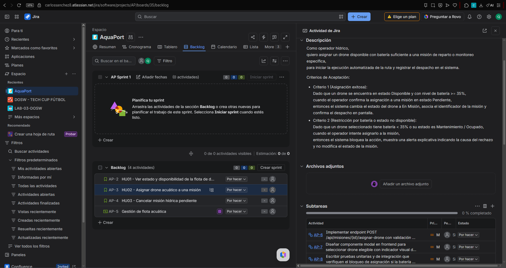

### Reto 10: Diagramas de Casos de Uso (UML)

Se modeló el comportamiento funcional del sistema AquaPort MVP centrado en el requerimiento nuclear AP-01, representando los límites del sistema, actores involucrados y las relaciones de dependencia mediante casos de uso.

Aspectos modelados:
* Límite del sistema: AquaPort MVP como contenedor de las funcionalidades operativas.
* Actores:
  * Operador Hídrico: Actor principal que interactúa con la gestión de flota y registro de misiones.
  * Solicitante: Consulta el avance y estado de entrega de sus muestras.
  * Administrador ECI: Consulta estadísticas generales y reportes de desempeño de la flota.
* Casos de uso principales: Registrar misión de transporte, Consultar disponibilidad de flota, Cancelar misión pendiente, Consultar estado de misión y Generar reportes de operación.
* Relación «include» (Obligatoria): Registrar misión incluye indispensablemente Validar disponibilidad y batería del drone, garantizando que ninguna misión se genere sin verificación previa.
* Relación «extend» (Condicional): Registrar misión es extendido por Alertar batería en umbral crítico, disparado únicamente bajo la condición de que la batería del drone seleccionado se encuentre entre 35% y 40%.

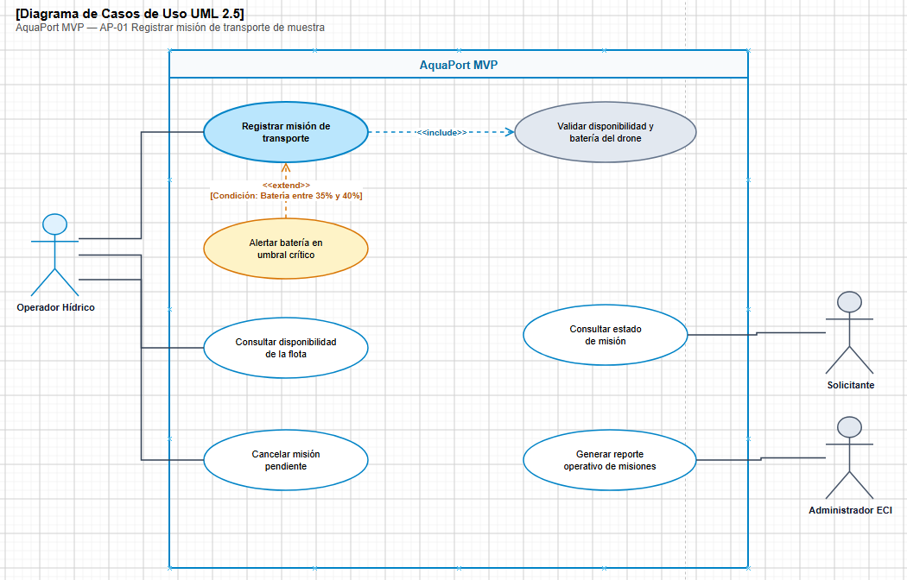

### Reto 11: Mocks con IA y Estados de Interfaz

Se generaron los diseños de alta fidelidad para el panel de monitoreo del operador utilizando inteligencia artificial, definiendo los tres estados operativos requeridos para el MVP a partir del manual de identidad y las especificaciones del requerimiento AP-01.

Aspectos modelados en los tres estados:
* Estado Normal (Operación estándar): Visualización de los cuatro drones con diversas condiciones de disponibilidad, selección del drone AR-03 con bloqueo del botón de asignación y advertencia explicativa por carga insuficiente (18% frente al 35% mínimo).
* Estado de Alerta (Incidencia técnica): Detección y destaque visual de fallo en el drone AR-04 en Laguna Sur mediante contenedor cromático diferenciado (#FF5C61) y banner preventivo superior para retirar la unidad de asignación.
* Estado Sin Disponibles (Saturación de flota): Representación de la flota con todas las unidades en misión activa, desactivación de acciones de despacho y componente informativo con sugerencia del siguiente drone próximo a liberarse.

Cumplimiento de usabilidad:
La verificación y cumplimiento de las heurísticas de Jakob Nielsen (#1, #2, #4, #5, #8 y #9) aplicadas en estos tres estados fue documentada y detallada previamente en la tabla del Reto 08.

#### Prompt utilizado para la generación

```text
Diseña 3 frames de escritorio para AquaPort, panel de flota de 4 drones acuáticos. Todo en español. Dashboard técnico oscuro, sin sombras ni fotos.
COLORES: fondo #08202E; superficie #0F3144, borde #1E4358; barra superior #0B4F6C; acento #19B5D1; texto #E4F0F5, secundario #9DB8C5. Estados (forma + texto): Disponible #34C77B círculo; En misión #4C9BFF rombo; Recargando #F5A524 gota; Mantenimiento #8C9AA3 cuadrado; Fallo #FF5C61 triángulo. FUENTES: IBM Plex Sans; JetBrains Mono para IDs y porcentajes.

ESTRUCTURA (igual en los 3):
Barra superior 64 px: "AquaPort" (Aqua #E4F0F5, Port #19B5D1) y "Operador Hídrico" a la derecha.
Título "Monitoreo de la flota" 28 px y 5 contadores de estado.
4 tarjetas en fila, 318x232 px, padding 20: ID (AR-01, mono 22 px) y chip de estado; barra de batería 8 px (roja si <35%); filas Batería y Zona.
Botón "Asignar a misión" 44 px alto, fondo #19B5D1, texto #04212B; deshabilitado #26434F. Mensaje al lado, 14 px en #FFC773. Seleccionada: borde 2 px #19B5D1. No asignables: opacidad 72%.

FRAME "01 Normal" (AR-03 seleccionada): AR-01 Disponible 86% Laboratorio Hídrico; AR-02 En misión 62% Canal Central; AR-03 Recargando 18% Embalse Norte; AR-04 Mantenimiento 74% Laguna Sur. Botón deshabilitado, mensaje: "El drone AR-03 tiene batería insuficiente (18%). Mínimo requerido: 35%."

FRAME "02 Alerta": igual, pero AR-03 Recargando 41% y AR-04 Fallo 55% Laguna Sur (borde #FF5C61, fondo #2A1A20). Banner bajo el título (fondo #3A1519, borde #FF5C61, texto #FFD6D8): "AR-04 reporta fallo en Laguna Sur. Retira el drone de la asignación."

FRAME "03 Sin disponibles": 4 drones En misión (AR-01 78% Punto Ribereño Este; AR-02 62% Canal Central; AR-03 90% Embalse Norte; AR-04 67% Laguna Sur). Mensaje "Selecciona un drone para continuar." Bloque de borde punteado: "No hay drones disponibles. AR-02 es el siguiente en liberarse."

Cumple Nielsen #1, #2, #4, #5, #8, #9. Usa auto layout y estilos reutilizables.
```

#### Evidencias de los Tres Estados del Panel


### Reto 12: Desarrollo Guiado por Pruebas (TDD) en ValidadorMision

Se implementó el componente de validación de reglas de negocio ValidadorMision siguiendo el ciclo estricto de TDD (Red, Green, Refactor) con JUnit 5 y el patrón Arrange-Act-Assert (AAA).

Fases del ciclo ejecutadas:
* Fase Red (Pruebas primero): Se escribieron anticipadamente las pruebas unitarias en ValidadorMisionTest especificando los escenarios esperados antes de consolidar el código de producción.
* Fase Green (Código mínimo): Se construyeron los métodos tieneBateriaSuficiente, validarPuntoPartida, validarPuntoLlegada y validar, permitiendo que la suite completa de 14 pruebas pasara exitosamente.
* Fase Refactor (Optimización y diseño limpio): Se modularizó la lógica de verificación de zonas a través del método privado validarZona, centralizando mensajes descriptivos en español y eliminando duplicación de código sin alterar el comportamiento observable.

Escenarios de prueba validados:
* Asignación permitida para drones con batería mayor al 35% y en el umbral exacto del 35%.
* Bloqueo inmediato para drones con batería crítica (< 35%) o en estado nulo.
* Excepciones de tipo IllegalArgumentException ante puntos de partida o llegada nulos o en blanco.
* Manejo de casos de borde (edge cases) para ubicaciones no pertenecientes a las zonas hídricas oficiales del campus.
* Restricción operativa que impide registrar misiones donde el punto de partida y llegada sean idénticos.
* Trazabilidad de commits: Registro histórico con commits independientes para la especificación de pruebas (RED), la implementación funcional (GREEN) y la optimización estructural (REFACTOR).

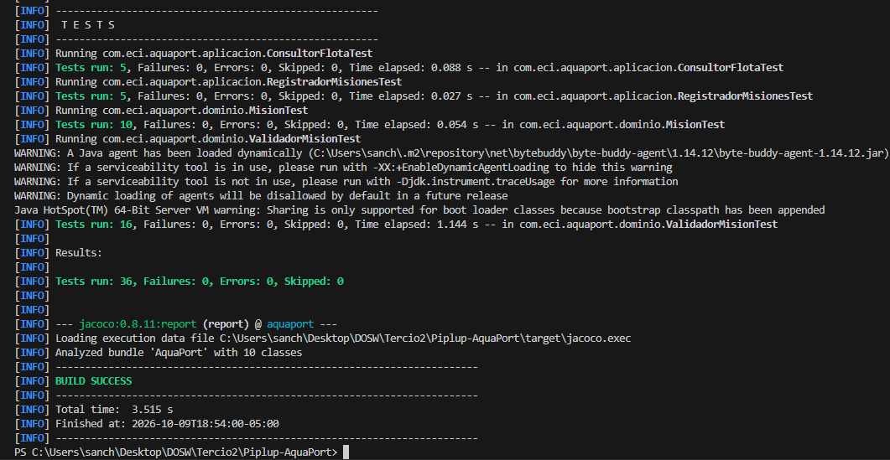

### Reto 13: Cobertura de Código con JaCoCo

Se configuró el plugin de JaCoCo en el ciclo de construcción de Maven para medir, auditar y garantizar la cobertura de pruebas unitarias sobre la lógica de negocio del sistema.

Métricas y resultados obtenidos:
* Umbral mínimo requerido: 80% de cobertura de líneas.
* Cobertura alcanzada en ValidadorMision: 100% en instrucciones, 100% en ramas de decisión (20 de 20 ramas) y 100% en líneas de código.
* Cobertura global del paquete de dominio (com.eci.aquaport.dominio): 100% en instrucciones (433 de 433) y 100% en ramas (46 de 46).
* Ausencia de ramas parciales o código muerto en las validaciones de negocio.
* Generación automatizada del reporte HTML en target/site/jacoco/index.html en cada ejecución de la fase de pruebas.

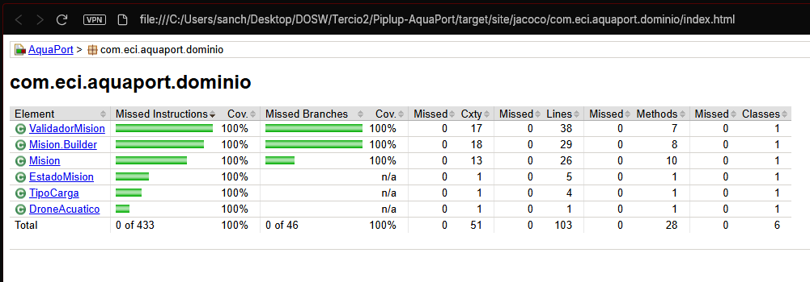

### Reto 14: Análisis Estático con SonarQube

Se realizó la auditoría de calidad de código mediante análisis estático con SonarQube, asegurando el cumplimiento del estándar de calidad definido para el nivel Piplup (MVP).

Métricas y objetivos de calidad:
* 0 Bugs identificados en la lógica de negocio y persistencia.
* 0 Vulnerabilidades de seguridad.
* Deuda técnica en 0 minutos para el alcance del MVP.
* Resolución de Code Smells: Se refactorizó la clase NotificadorOperadorConsola eliminando el uso de flujos estándar directos (System.out y System.err - regla java:S106), sustituyéndolos por un Logger parametrizado con niveles semánticos INFO y SEVERE para evitar degradación de rendimiento y permitir redirección de trazas.
* Sin supresión artificial: Ningún issue fue ocultado mediante anotaciones @SuppressWarnings, resolviendo cada hallazgo en su causa raíz.

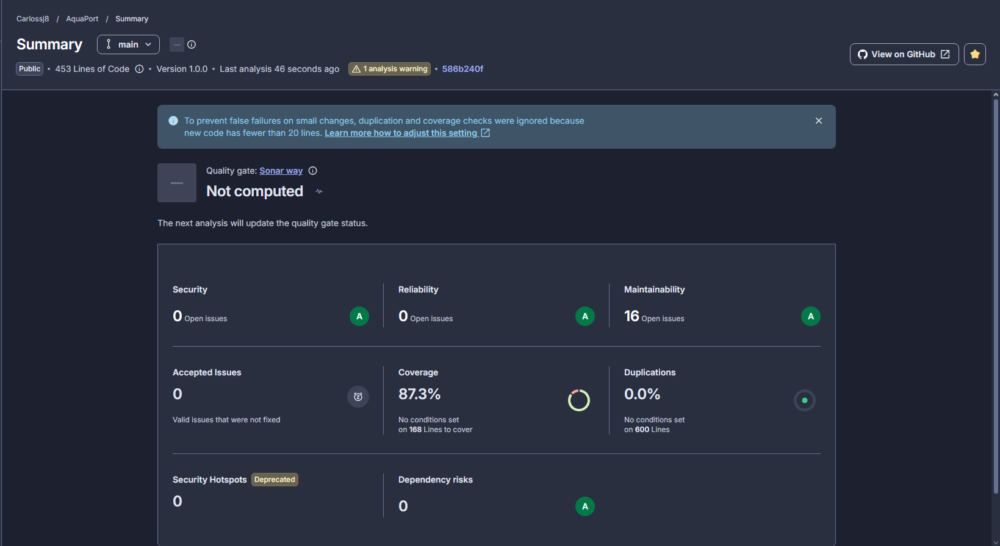


